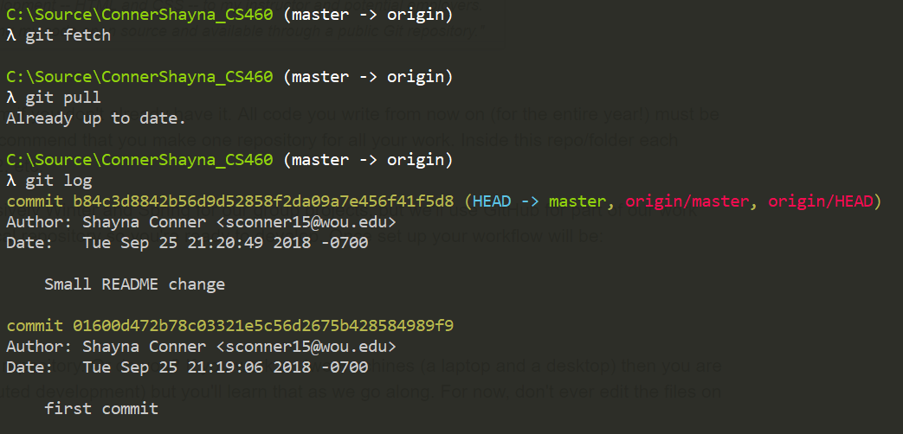
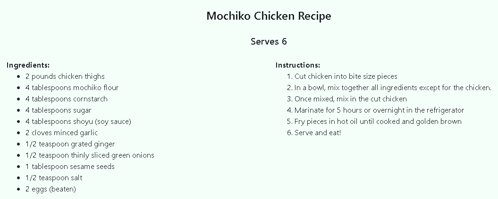
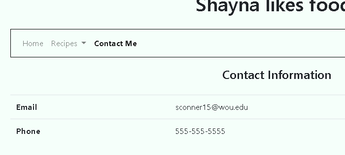

# Homework 1
For the first homework assignment, we were asked to use Git (from the command line), HTML, CSS, and Bootstrap. I am familiar with all of these though it has been a while since I have started web projects from the ground up. Lately, I've mostly had to use ASP.NET MVC with Razor views. 

* [Click here for final assignment site](https://shaynuhcon.github.io/ConnerShayna_CS460/HW1/index.html)
* [Code repo for final assignment site](https://github.com/shaynuhcon/ConnerShayna_CS460/tree/master/HW1)

## Setup
There wasn't much for me to setup software/tooling wise. I currently have Visual Studio, Visual Studio Code and cmder already installed to my local machine. I use cmder because you run different shells out of it as well as Git command line operations and it's just a more readable (prettier) command line interface. I am familiar with how Git works and have used it for GitHub and for Visual Studio Team Services (now Azure DevOps) but never for BitBucket. Per the instructions on this assignment, I went with GitHub.  

## Git/GitHub Journey
To start off, I created an empty repository on GitHub called ConnerShayna_CS460 then I just created a local folder by the same name to store local code files. The requirements summary stated that Git operations should be done from command line only so I initialized my code repository locally first using the following commands:

```
cd C:\Source\ConnerShayna_CS460
touch README.md
git init
git config --global user.email "sconner15@wou.edu"
git config --global user.name "Shayna Conner"
```

Then to get my local code to my GitHub repo I ran the following commands:

```
git add -A
git commit -m "first commit"
git remote add origin https://github.com/shaynuhcon/ConnerShayna_CS460.git
git push -u origin master
```

The ```-A``` option in ```git add -A``` just adds all files to staging. There's several different ways of doing this but that's just how I've always done it so it's habit now. After the first push, I made a small change to the README file to run the ```git status``` command then did another add, commit, and push then verified that change made it to my GitHub repo. Then I ran the ```git fetch``` and ```git pull``` commands but my local repo was already caught up. The ```git log``` command shows both commits made (screenshot below):



## The Website
I used Visual Studio Code as my HTML/Markdown/CSS editor. Once I figured out what I wanted to make the page about, it was mostly about just getting the components on there. I went with food recipes because that's the first thing that came to my mind when I thought of ```ol``` and ```ul``` lists.  

The website itself has 4 pages and one CSS style sheet: home page, two recipe pages, and a contact page. Bootstrap was used on all pages and they all have consistent styles and header/navbar components. The home page is a single column layout and the recipe pages are two column layout pages. 

I used the list components on the recipe pages as shown below in the screenshot and code snippet:



```html
<div class="container">
    <div class="row">
        <div class="col-md">
            <b>Ingredients:</b>
            <!-- Unordered list -->
            <ul>
                <li>2 pounds chicken thighs</li>
                <li>4 tablespoons mochiko flour</li>
                <li>4 tablespoons cornstarch</li>
                <li>4 tablespoons sugar</li>
                <li>4 tablespoons shoyu (soy sauce)</li>
                <li>2 cloves minced garlic</li>
                <li>1/2 teaspoon grated ginger</li>
                <li>1/2 teaspoon thinly sliced green onions</li>
                <li>1 tablespoon sesame seeds</li>
                <li>1/2 teaspoon salt</li>
                <li>2 eggs (beaten)</li>
            </ul>
        </div>
        <div class="col-md">
            <b>Instructions:</b>
            <!-- Ordered list -->
            <ol>
                <li>Cut chicken into bite size pieces</li>
                <li>In a bowl, mix together all ingredients except for the chicken.</li>
                <li>Once mixed, mix in the cut chicken</li>
                <li>Marinate for 5 hours or overnight in the refrigerator</li>
                <li>Fry pieces in hot oil until cooked and golden brown</li>
                <li>Serve and eat!</li>
            </ol>
        </div>
    </div>
</div>
``` 

Then I used a table on the contact page as shown below in the screenshot and code snippet:



```html
<!-- Table -->
<table class="table">
    <tbody>
        <tr>
            <th scope="row">Email</th>
            <td>sconner15@wou.edu</td>
        </tr>
        <tr>
            <th scope="row">Phone</th>
            <td>555-555-5555</td>
        </tr>
    </tbody>
</table>
 ```           

