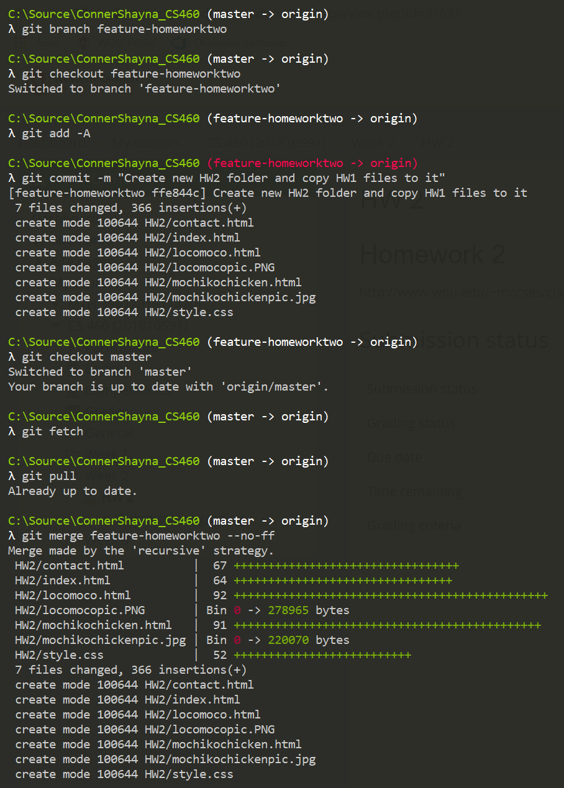
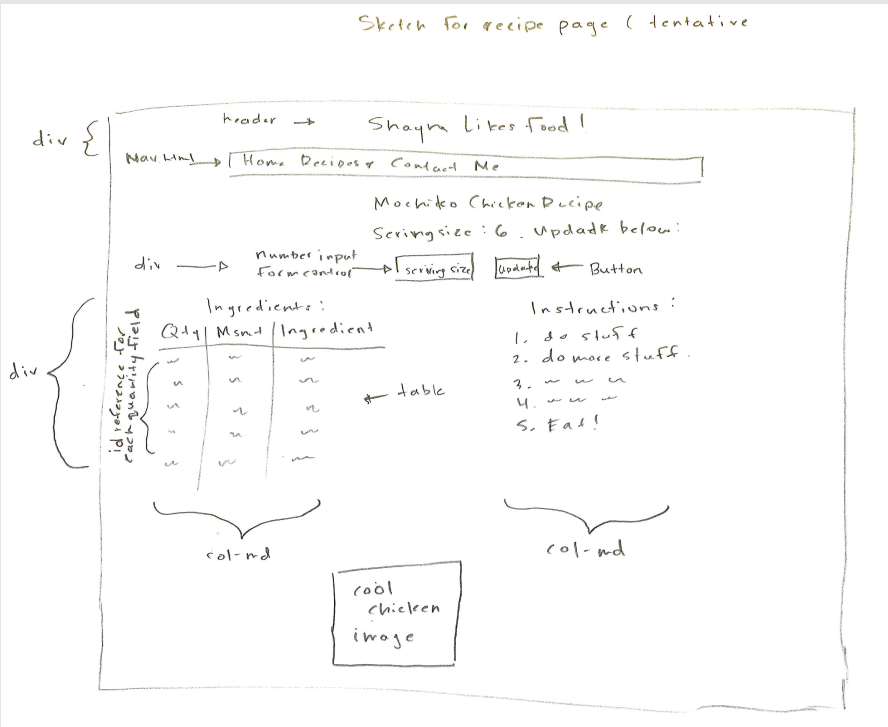
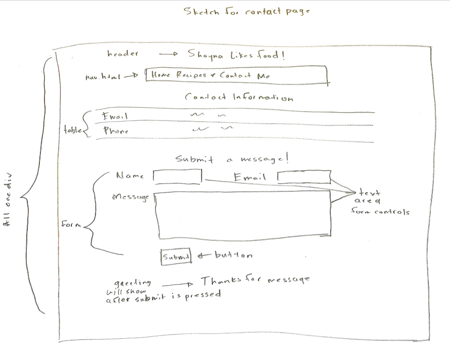
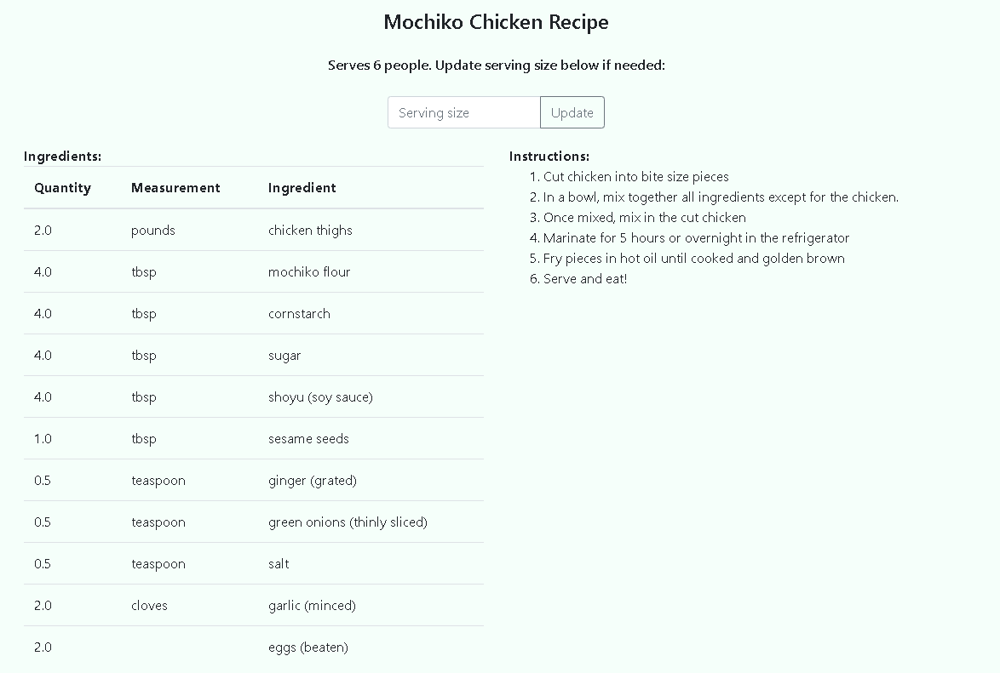
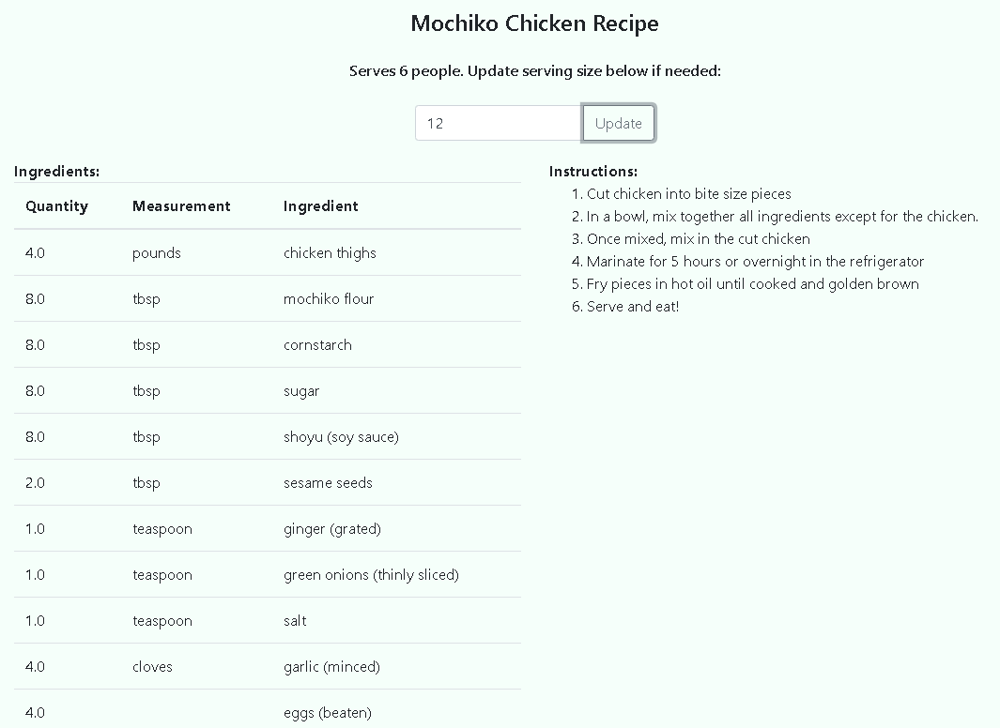
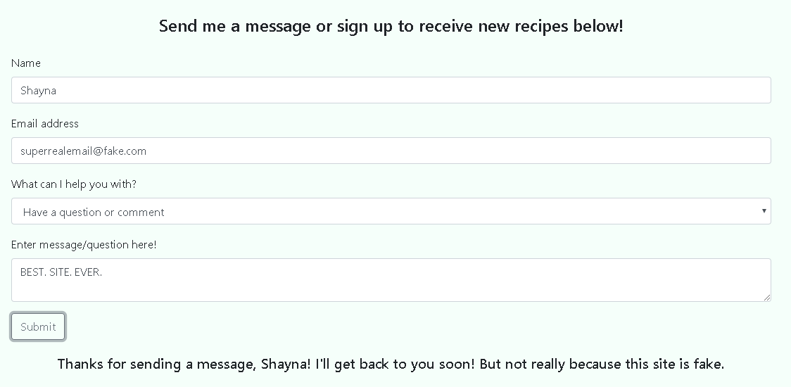
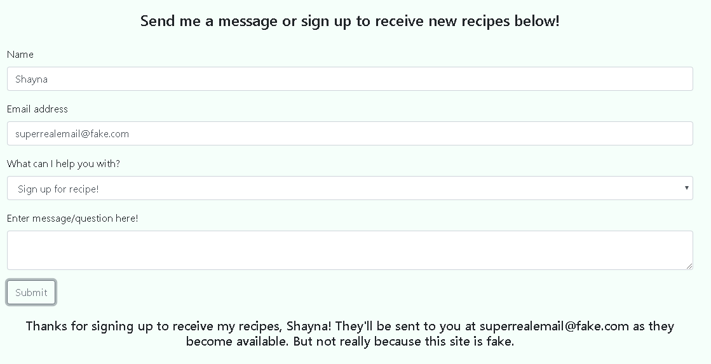

# Homework 2
For this second homework assignment, we played around with Javascript and jQuery mostly and started using feature branches. 

* [Assignment page](http://www.wou.edu/~morses/classes/cs46x/assignments/HW2.html)
* [Final website](https://shaynuhcon.github.io/ConnerShayna_CS460/HW2/index.html)
* [Code repo for final assignment website](https://github.com/shaynuhcon/ConnerShayna_CS460)
* [Back to main page](../README.md)

---

## Git Commands
For our Git commands, we started using ```branch```, ```checkout```, and ```merge```. I've used these before and have had my fair share of merge conflict nightmares so I felt comfortable using it here. These are the commands I used to originally create my feature branch: 



I did all my staging and commits in feature branches for both my homework assignment repository and my GitHub page repository. When ready, I merged the changes into master and pushed from there. This was different from what I'm used to since I've normally used pull requests to merge with master. 

## Design/planning
For the Javascript/jQuery portion of this assignment, I decided to modify and build off of the website from the first assignment. I knew that I needed to do some sort of calculation and the only type of calculations I could think of (in regards to this specific site) was to do calculations on the quantity portions of the recipes page. The original sketch for this page can be found here: 



I also wanted some type of form submission and since I had a Contact page I figured that would be the perfect place. Here is the sketch for that page: 



## The Website

### Navigation bar
In the last assignment, I didn't want to jump ahead and use Javascript so I manually copied my navigation bar into each HTML page in my project. This time around, I made it  so that I had one nav.html page and used jQuery to load the navigation bar into each HTML page using the following script so I didn't have to edit each HTML page manually for navigation bar changes: 

```javascript 
$("#nav-placeholder").load("nav.html");
``` 

### Recipe page
Originally the recipes page had the ingredients listed in an unordered list. For better flexibility and readability, I switched the ingredients list to a table. From there, I added an ID to each row in the Quantity column so that I could grab each ID and perform calculations on them. When a user lands on the page, it calculates and displays quantities for 6 people:



When a user enters a new number and clicks Update, new quantities will be calculated and shown to the user in the Quantity column as shown below:



At first, I was going to use one ID for each ingredient quantity but decided to just break those out since there aren't that many ingredients. This function is called when the user clicks the Update button:

```javascript
  $("#update").click(function () {
    var sizeVal = $("#size").val();

    $("#chicken").text(Calculate(sizeVal, "chicken"));
    $("#flour").text(Calculate(sizeVal, "flour"));
    $("#cornstarch").text(Calculate(sizeVal, "cornstarch"));
    $("#sugar").text(Calculate(sizeVal, "sugar"));
    $("#shoyu").text(Calculate(sizeVal, "shoyu"));
    $("#seeds").text(Calculate(sizeVal, "seeds"));
    $("#ginger").text(Calculate(sizeVal, "ginger"));
    $("#gronions").text(Calculate(sizeVal, "gronions"));
    $("#salt").text(Calculate(sizeVal, "salt"));
    $("#garlic").text(Calculate(sizeVal, "garlic"));
    $("#eggs").text(Calculate(sizeVal, "eggs"));
});
```

For each food item, the Calculate function is called which just takes the sizeVal (the user input) and the food item and calculates the new value based on those. I used a switch statement for this since some of the ingredients have the same original quantity and yes, the original values are very long floating points but that was because I wanted the measurements to be as precise as possible:

```javascript 
// Calculates serving size portions
function Calculate(sizeVal, food) {
    switch (food) {
        case "chicken":
        case "garlic":
        case "eggs":
            return (Math.round((0.33333333333333333333333333333333333333333333333333333333333333333333333333333333333333333333333333333333333333333333333333333333333333333333333333333333333333333333333333333333333333333333333333333333 * sizeVal) * 2) / 2).toFixed(1);
        case "flour":
        case "cornstarch":
        case "sugar":
        case "shoyu":
            return (Math.round((0.66666666666666666666666666666666666666666666666666666666666666666666666666666666666666666666666666666666666666666666666666666666666666666666666666666666666666666666666666666666666666666666666666666667 * sizeVal) * 2) / 2).toFixed(1);
        case "seeds":
            return (Math.round((0.16666666666666666666666666666666666666666666666666666666666666666666666666666666666666666666666666666666666666666666666666666666666666666666666666666666666666666666666666666666666666666666666666666667 * sizeVal) * 2) / 2).toFixed(1);
        case "ginger":
        case "gronions":
        case "salt":
            return (Math.round((0.083333333333333333333333333333333333333333333333333333333333333333333333333333333333333333333333333333333333333333333333333333333333333333333333333333333333333333333333333333333333333333333333333333333 * sizeVal) * 2) / 2).toFixed(1);
    }
};
```

### Contact page
For the Contact page, I just added a form submission where a user could "submit" a message to me (not really). A user can either choose to send a question or comment or they can sign up to receive emails about recipes. Depending on which they choose, a custom will display to the user. This was just a way to get input then display that input back to the user in a new element instead of updating old elements. Here is what a user would see if they chose to send a question or comment:



This just displays the user's name back to them. Here is what the user would see when signing up for emails:



The logic for this was handled by one function: 

```javascript
$("#submit").click(function () {
    var name = document.getElementById("nameInput").value;
    var email = document.getElementById("emailInput").value;
    var type = document.getElementById("selectInput").value;
    
    if(type == "Have a question or comment")
    {
        $("#greeting").text("Thanks for sending a message, " + name + "! I'll get back to you soon! "
        + "But not really because this site is fake.");
    }
    else
    {
        $("#greeting").text("Thanks for signing up to receive my recipes, " 
        + name + "! They'll be sent to you at " + email + " as they become available. "
        + " But not really because this site is fake.");
    }
});
```

