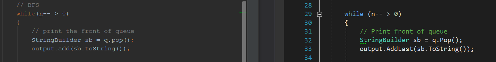
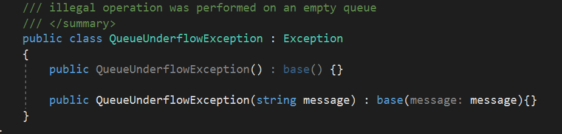
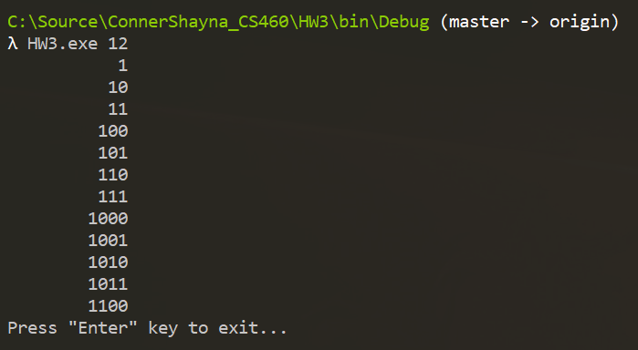

# Homework 3
For this assignment, we started to play around with C#. As a way of introducing C# to the class, we translated a Java program to C#. 

* [Assignment page](http://www.wou.edu/~morses/classes/cs46x/assignments/HW3_1819.html)
* [Code repo for assignment](https://github.com/shaynuhcon/ConnerShayna_CS460/tree/master/HW3)
* [Back to main page](../README.md)

---

## Git Commands
Used a new feature branch for both repositories (homework and blog). Wasn't sure if we were supposed to push these out to Github as well but I did anyway. Once I was sure the code worked properly for both repositories, I merged them to master as usual and pushed.

## Preparation
I was confident going into this assignment because I work in C# every day for work. We use .NET tools, Azure, AWS, SQL Server, and several other tools so I was excited to see that a lot of the tools I work with on a daily basis were also on the syllabus/objectives for this Senior series.

Coming from the Programming circuit at Chemeketa Community College, I also have experience in Java thanks to the 3 part Java series taught by Darrel Karbginsky and through my own personal projects. Regardless of my experience with C# or Java, I still don't skip steps no matter what project I'm working on. You can't progress as a developer (a good one, anyway) nor do you gain/keep good coding habits if you skip steps and forget basics. You also might lose out on a chance to learn something new.

Before coding anything, I put breakpoints in each of the Java methods and debugged through the code noting how the inputs, outputs, and variable values changed throughout each step. Once I was familiar with what the program was doing, I started coding. 

## Translating 
For the actual coding, I started out by creating a class in my C# console project for each class that existed in the Java project then just worked backwards coding classes that didn't rely on something else I hadn't written yet already which meant start with the interface first then ending with the Main method in my Program.cs file. 

A lot of it was pretty straight forward to me as far as going from Java to C#. When I came across something I didn't know how to translate off the top of my head, I would look up that class in both the Java and C# documentation to compare the differences. For example, the LinkedList implementation in C# does not have an ```add()``` method like Java's implementation does. At first I assumed for some reason that C#'s ```AddFirst()``` method would be the equivalent but it turned out to be the AddLast() method. Code snippet from the Java project and from my console app can be seen below (C# on right):



I have never written a custom exception class before so that was something new. I knew that I needed to inherit from a base exception but just didn't know which so I had to look that part up. The empty constructor isn't being used but I left it there anyway since it's in the Java code:




Something I did struggle with was not using the ```var``` keyword for local variables. We use it for all local variables in our code repositories (at my job, anyway) and in my opinion it makes code look cleaner. It may be a problem for not recognizing data types right away but I believe that if someone isn't naming their variables in a manner where it's obvious what the data type is then that would tell me there needs to be better naming conventions put in place.

## Testing
I ran the C# code both in Visual Studio's debug mode with breakpoints to confirm that I was seeing the same inputs, outputs, and variable values that I did when I debugged through the Java code. Once I saw those same values and same final console output, I ran the .exe from the command line and confirmed it gave the same output:


