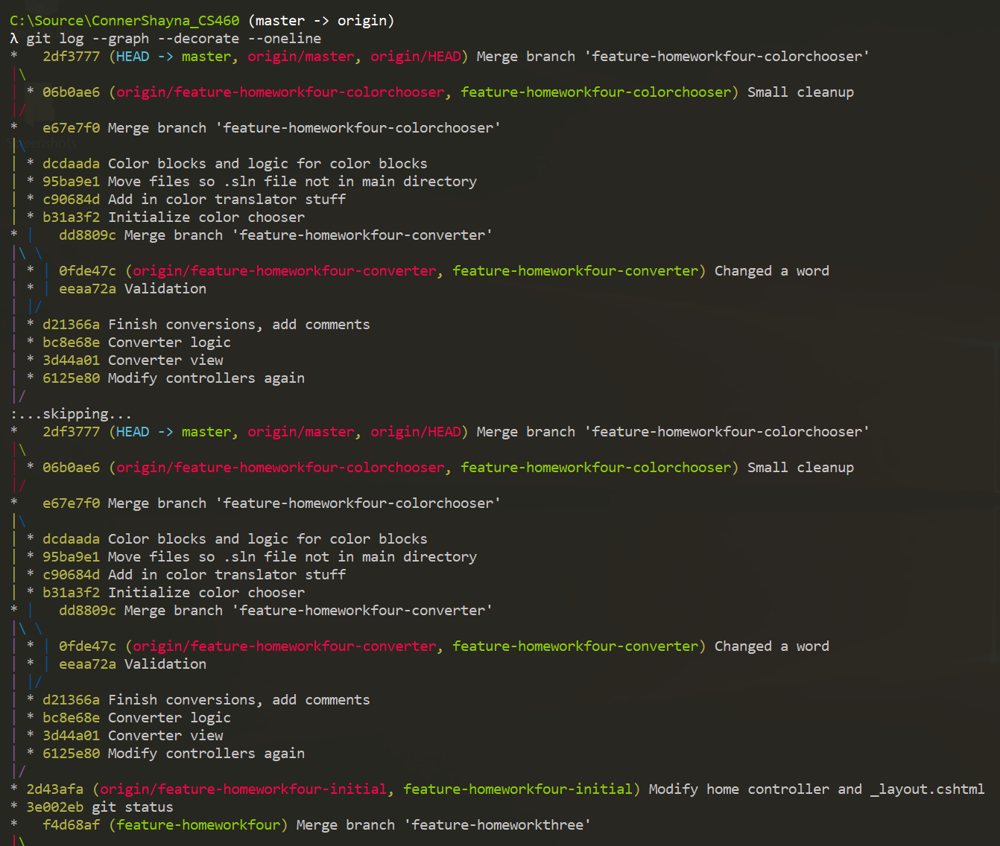
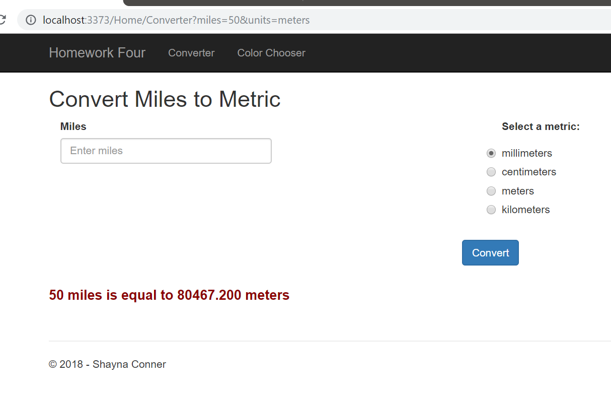
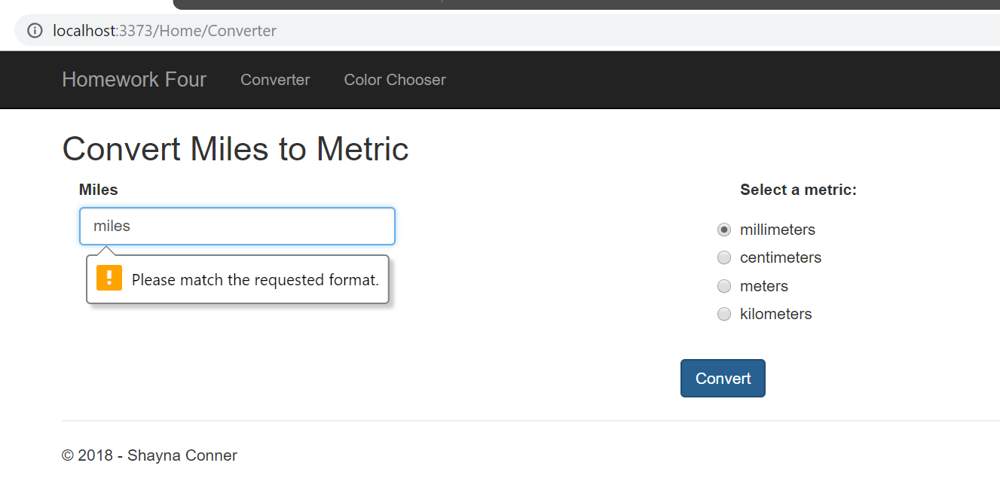
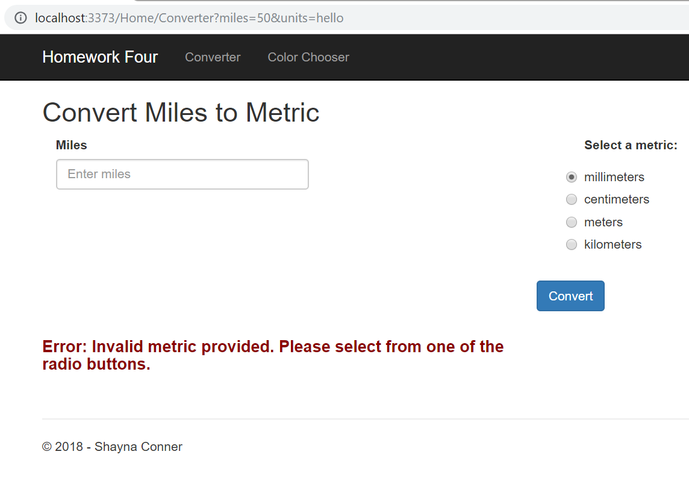
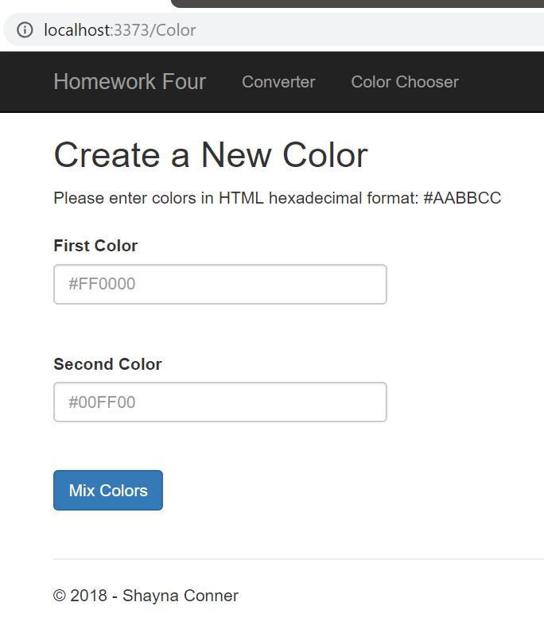
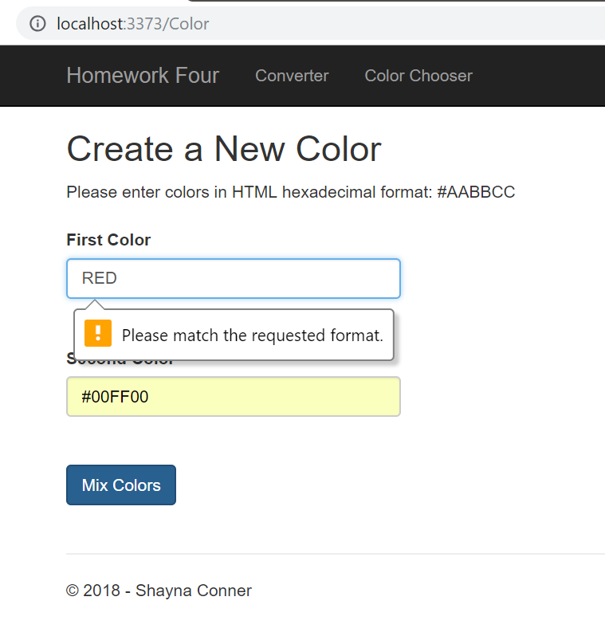
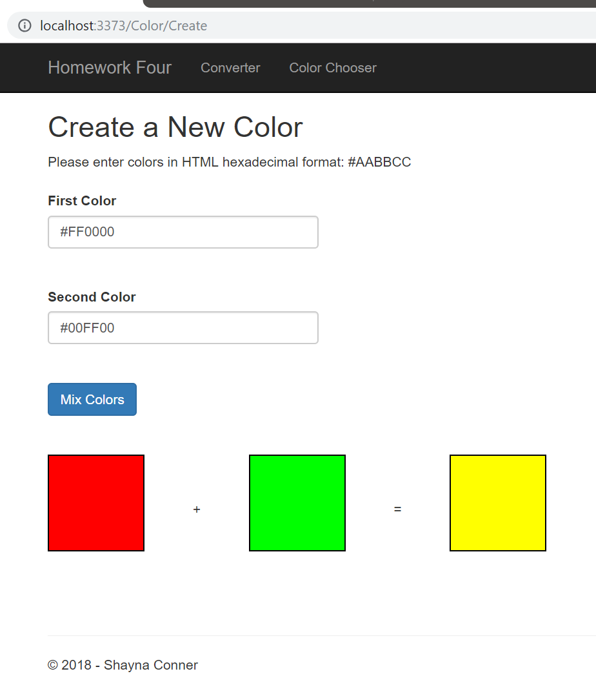

# Homework 4
Our objectives for this assignment were to learn ASP.NET MVC 5 but without using a database. We utilizied both GET and POST methods in our controllers and used simple routing and parameter binding to retrieve input from our views. 

* [Assignment page](http://www.wou.edu/~morses/classes/cs46x/assignments/HW4_1819.html)
* [Code repo for assignment](https://github.com/shaynuhcon/ConnerShayna_CS460/tree/master/HW4)
* [Back to main page](../README.md)

---

## Git Branching
For this project, I used the following 3 branches which can also be shown in the Git map below:

* `feature-homeworkfour-initial`
* `feature-homeworkfour-converter`
* `feature-homeworkfour-colorchooser`



I used `feature-homeworkfour-initial` branch to initialize the MVC project and to remove unnecessary files that I wouldn't be using for this project. 

Then I used `feature-homeworkfour-converter` branch to do the controller method and view for the Converter page and the `feature-homeworkfour-colorchooser` branch to do the controller, controller method, and view for the Color Chooser page.

After each feature was complete, I merged all three branches back into master and pushed them out. I didn't have any merge conflicts since none of my changes in each feature branch overlapped and since I merged my branches in the order I created them. 

Once they were all merged in, I used the most recent `feature-homeworkfour-colorchooser` branch to do some small changes/fixes and merged that back into master for the final page. 

## Initialization 
To get a foundation going for this MVC project, I created an MVC project and laid things out so that when I switched to adding the Converter page and Color Chooser page, I wouldn't need to edit/modify too many things along the way. For example, I removed a lot of the unnecessary code from Controllers for the Contact view and also removed stock Bootstrap/ASP.NET/MVC from the Views. 

## Miles to Metric Converter page 
For these pages, we were told that we could make them look however we wanted as long as the functionality was there but I just stuck to trying to make it match what I saw on the assignment page. Unfortunately, I'm not a very creative person when it comes to design or aesthetics but working on it. Here is a screenshot of what the Converter page looks like with an input of 50 miles and meters for the metrics input:



For validation, I added a RegEx pattern to the Miles input field so that a user can only submit any whole number or decimal. At first I used `input type="number" step="any"` so it wouldn't give the user an option to enter anything else but a number but I like this way better because users wouldn't think that the box is broken if they can't type anything in it. With the text input, they can still enter non-numerical values into the textbox but it will show a message with a reason if it's invalid:

```html
<input type="text" class="form-control" id="miles" name="miles" pattern="^(\d*\.)?\d+$" placeholder="Enter miles">`
```



I also added validation in my controller method for cases where the user provides invalid input through the route request. This way if a user attempts to provide a non-numerical value for miles through the route or if they attempt to provide an input for metric that isn't one of the four displayed options, an error message will be displayed on the page as shown below: 



For the calculations, I used a simple switch statement which would calculate the conversion based on the miles and metric given by the user. The full method can be found below:

```csharp
 [HttpGet]
        public ActionResult Converter()
        {
            // Retrieve input values from Request object
            string milesInput = Request.QueryString["miles"];
            string unitsInput = Request.QueryString["units"];

            // Only do conversions if miles value has been provided by user
            if (!milesInput.IsNullOrWhiteSpace())
            {
                decimal convertedMiles = 0;

                // Validate miles input and return error message if non-numeric value
                if (!Decimal.TryParse(milesInput, out decimal miles))
                {
                    ViewBag.OutputMessage = "Error: Miles given must be a numerical value.";
                    return View();
                }
                
                // Calculate miles to unit conversion
                switch (unitsInput)
                {
                    case "millimeters":
                        convertedMiles = miles * 1609000m;
                        break;
                    case "centimeters":
                        convertedMiles = miles * 160934.4m;
                        break;
                    case "meters":
                        convertedMiles = miles * 1609.344m;
                        break;
                    case "kilometers":
                        convertedMiles = miles * 1.609m;
                        break;
                    default:
                        ViewBag.OutputMessage = "Error: Invalid metric provided. Please select from one of the radio buttons.";
                        return View();
                }

                // Output message to display conversion
                ViewBag.OutputMessage = $"{miles} miles is equal to {convertedMiles} {unitsInput}";
            }

            return View();
        }
    }
```

Then in the view itself, I used a textbox and radio buttons as shown in the screenshots (and below) then used ViewBag to transfer my output from the Controller to the View which can be found at the bottom of this HTML code:  

```html
<body>
<h2>Convert Miles to Metric</h2>

@* Form inputs for entering miles and choosing a unit *@
<form action="Converter" method="get">
    <div class="container">
        <div class="row">
            @* Textbox for user's miles input *@
            <div class="col-md-6">
                <div class="form-group">
                    <label for="miles">Miles</label>
                    <input type="text" class="form-control" id="miles" name="miles" pattern="^(\d*\.)?\d+$" placeholder="Enter miles">
                </div>
            </div>

            @*Radio buttons for units of measurement*@
            <div class="col-md-6">
                <label>Select a metric:</label>
                <div class="radio">
                    <input type="radio" name="units" value="millimeters" checked>millimeters<br />
                </div>
                <div class="radio">
                    <input type="radio" name="units" value="centimeters">centimeters<br />
                </div>
                <div class="radio">
                    <input type="radio" name="units" value="meters">meters<br />
                </div>
                <div class="radio">
                    <input type="radio" name="units" value="kilometers">kilometers<br />
                </div>
            </div>
        </div>
        <div class="row centered">
            <button type="submit" class="btn btn-primary">Convert</button>
        </div>
    </div>
</form>

@* Only display output message if values given by user and output has been assigned *@
@if (ViewBag.OutputMessage != null)
{
    <div class="row">
        <div class="col-md-6">
            <h4>@ViewBag.OutputMessage</h4>
        </div>
    </div>
}
</body>
```

## Color Chooser page 
The Color Chooser page started off just fine. I got the ColorController page along with my HttpPost method then started my View with basic labels and textboxes as shown below in the screenshot and form code:



```html
@using (Html.BeginForm("Create", "Color", FormMethod.Post))
{
    // Get first color (named firstColor) from user
    <div class="wrapped">
        @Html.Label("First Color")
        @Html.TextBox("firstColor", null, new {@class = "form-control", placeholder = "#FF0000", pattern = "^#+([a-fA-F0-9]{6}|[a-fA-F0-9]{3})$"})
    </div>

    // Get second color (named secondColor) from user
    <div class="wrapped">
        @Html.Label("Second Color")
        @Html.TextBox("secondColor", null, new {@class = "form-control", placeholder = "#00FF00", pattern = "^#+([a-fA-F0-9]{6}|[a-fA-F0-9]{3})$"})
    </div>

    <div class="wrapped">
        <button type="submit" class="btn btn-primary">Mix Colors</button>
    </div>
}

```
Much like the Converter page, I used a RegEx pattern again to validate the hexadecimal input provided by the user only this time, I added the pattern in a Razor control as shown in the above code and in the below screenshot:



Those parts were all pretty straightforward but then I was reminded why I'm not the biggest fan of CSS. I've been lucky enough to only need what CSS is already available to me or to have someone else on my team who works in that part of the stack figure out the CSS for me *\*knocks on wood\**. I know the very basics of CSS and then when it comes to child elements and inheriting from other elements, that's when I start to pull my hair out and that was the case with the color blocks on this page. Making the blocks themselves was easy but it was getting them lined up with + and = sign that threw me off. There were many different ways I could've gone about accomplishing this part of the page and they were probably less stressful ways but once I started down the CSS road, I couldn't quit. Any little change I made to the CSS that I thought would align the boxes and operators perfectly and equally would come out completely different. Mostly the error was that my height/width values were all off but it took a while for me to get them on there correctly and here is a screenshot of the output in all its glory along with both the HTML and CSS below it:



```html
@*Checks if ViewBag.ColorOne is not null before showing color blocks. 
Not bothering to check other 2 ViewBag colors since all 3 colors should be assigned together*@
@if (ViewBag.ColorOne != null)
{
    <div class="wrapped">
        <div id="squareOne" style="background-color: @ViewBag.ColorOne"></div>
        <div id="plus">+</div>
        <div id="squareTwo" style="background-color: @ViewBag.ColorTwo"></div>
        <div id="equals">=</div>
        <div id="squareThree" style="background-color: @ViewBag.NewColor"></div>
    </div>
}
```

```css
#squareOne, #squareTwo, #squareThree {
    width: 100px;
    height: 100px;
    background: white;
    border: 1px solid black;
    display: inline-block;
}

#plus, #equals {
    width: 100px;
    height: 100px;
    vertical-align: middle;
    text-align: center;
    display: inline-block;
}
```

Again, I probably could've went about this a much cleaner way but by the time I got the CSS to do what I wanted it to, I didn't want to mess it up all over again so I left it the way it is. Once I got those blocks on the page, the rest was easy enough. I took in the hexadecimal inputs as string parameters then converted them to ARGB values in the Controller, did some calculations to get the third/new color and saved each color to its own ViewBag object. I added in a private method to do the actual RGB calculations to prevent repetitive code in my Create method:

```csharp
[HttpPost]
public ActionResult Create(string firstColor, string secondColor)
{
    // Convert user-provided colors to Color object
    Color firstRgb = ColorTranslator.FromHtml(firstColor);
    Color secondRgb = ColorTranslator.FromHtml(secondColor);

    // Math calculations on user-provided colors
    int reds = LimitValue(firstRgb.R, secondRgb.R);
    int greens = LimitValue(firstRgb.G, secondRgb.G);
    int blues = LimitValue(firstRgb.B, secondRgb.B);

    // Use calculated values to get new/third color
    Color newColor = Color.FromArgb(reds, greens, blues);

    // Assign colors to ViewBag objects
    ViewBag.ColorOne = ColorTranslator.ToHtml(firstRgb);
    ViewBag.ColorTwo = ColorTranslator.ToHtml(secondRgb);
    ViewBag.NewColor = ColorTranslator.ToHtml(newColor);

    return View();
}

// Ensures value of red, green, or blue value does not exceed 255
private int LimitValue(int first, int second)
{
    // Max value is 25
    const int max = 255;

    // Add both parameters and return that value if it's not greater than 255
    int value = first + second;
    if (value < max) return first + second;
    return max;
}
```