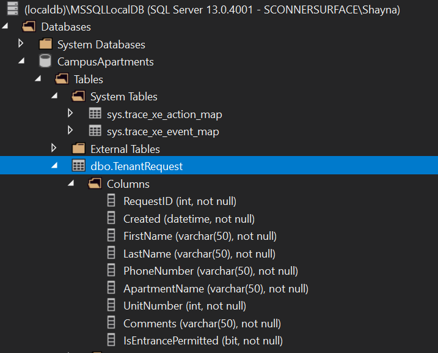
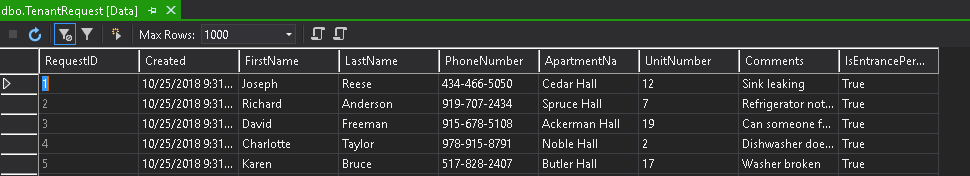
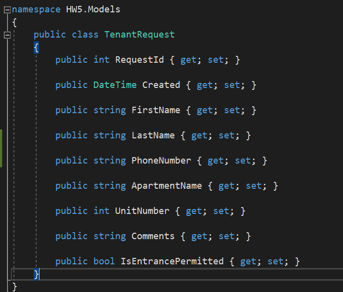
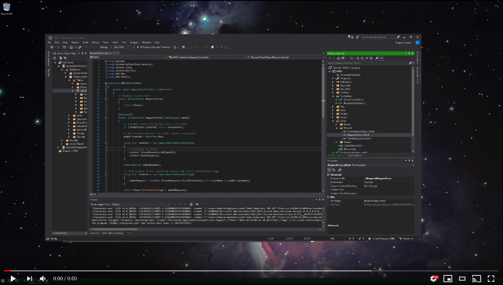

# Homework 5
Our objective for this was to create an MVC project that interacts with a local database. We used Entity Framework to read/write to our local database and used model validation to ensure incorrect values would not be inserted to the table. 

* [Assignment page](http://www.wou.edu/~morses/classes/cs46x/assignments/HW5_1819.html)
* [Code repo for assignment](https://github.com/shaynuhcon/ConnerShayna_CS460/tree/master/HW5)
* [YouTube video of project](https://youtu.be/lpgjOclANSk)
* [Back to main page](../README.md)

---

## Planning and Design
To start out, I created an MVC project just like the last assignment then I planned out my concept model so that I could build my database table first. Not a lot of columns and we are only using one table so that made things easier. For the naming scheme, I just stuck with what was used in the homework assignment page. For the database name, I used CampusApartments then I named the table TenantRequest. From there I populated the database with 5 rows of starter data.  I used the *Script As* option in Visual Studio's SQL Server Object Explorer to get my CREATE and DROP scripts then just added my seed data to the CREATE script so it would be run at the same time. Here are screenshots of the database, table, and starting entities:






## Content and Coding
Once my table and concept model were done, I added a TenantRequest class to my Models folder as shown below:



I have used ORMs like Entity Framework before so I mostly just went at this the way I would with any project so once I had my model, I created my DbContext class which I named CampusApartmentsContext just to keep it uniformed with the name of my database. It looks pretty much the same as the one that was 

```csharp
public class CampusApartmentsContext : DbContext
{
    public DbSet<TenantRequest> TenantRequests { get; set; }

    public CampusApartmentsContext() : base("name=CampusApartmentsContext"){}

    protected override void OnModelCreating(DbModelBuilder builder)
    {
        // Model configuration to map entity to model
        builder.Configurations.Add(new TenantRequestConfiguration());
    }
}
```


[](https://youtu.be/lpgjOclANSk)
