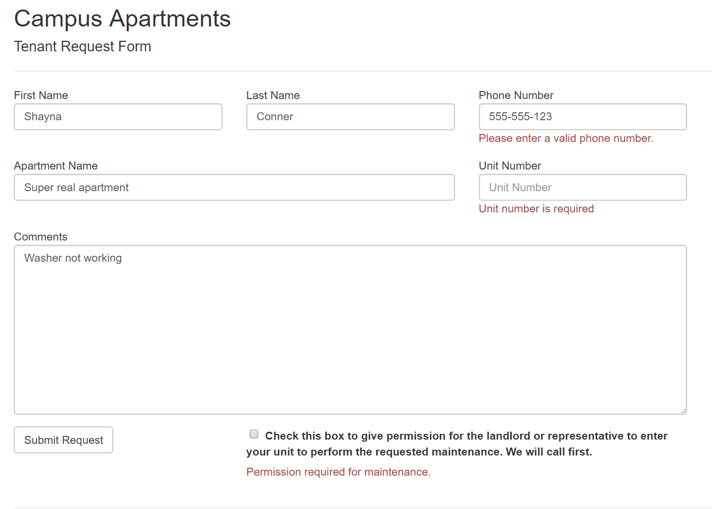
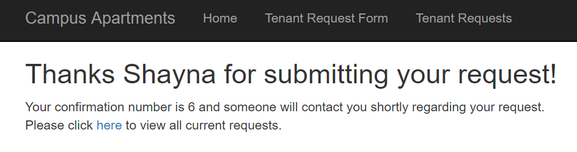
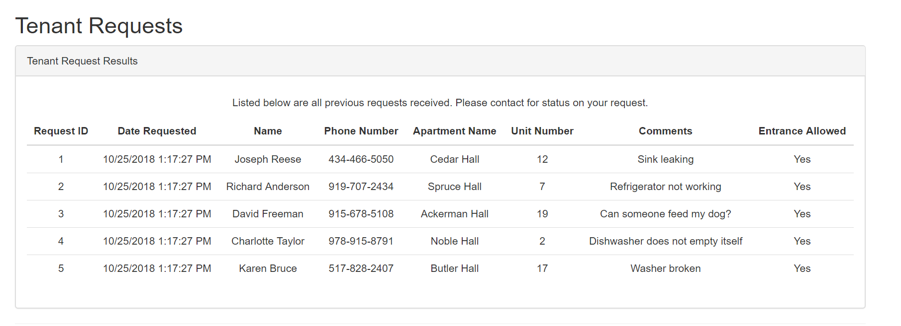

# Homework 5
Our objective for this was to create an MVC project that interacts with a local database. We used Entity Framework to read/write to our local database and used model validation to ensure incorrect values would not be inserted to the table. 

* [Assignment page](http://www.wou.edu/~morses/classes/cs46x/assignments/HW5_1819.html)
* [Code repo for assignment](https://github.com/shaynuhcon/ConnerShayna_CS460/tree/master/HW5)
* [YouTube video of project](https://youtu.be/lpgjOclANSk)
* [Back to main page](../README.md)

---

## Planning and Design
To start out, I created an MVC project just like the last assignment then I planned out my concept model so that I could build my database table first. Not a lot of columns and we are only using one table so that made things easier. For the naming scheme, I just stuck with what was used in the homework assignment page. For the database name, I used CampusApartments then I named the table TenantRequest. From there I populated the database with 5 rows of starter data.  I used the *Script As* option in Visual Studio's SQL Server Object Explorer to get my CREATE and DROP scripts then just added my seed data to the CREATE script so it would be run at the same time. Here are screenshots of the database, table, and starting entities:


## Entity Framework
Once my table and concept model were done, I added a TenantRequest model to my Models folder. I have used ORMs like Entity Framework before so I mostly just went at this the way I would with any project. Once I had my model, I created my DbContext class which I named CampusApartmentsContext just to keep it uniformed with the name of the database. It looks pretty much the same as the one that was shown in class except I also used DbModelBuilder to configure the mapping between my model and my table entity (method shown below):

```csharp
protected override void OnModelCreating(DbModelBuilder builder)
{
    // Model configuration to map entity to model
    builder.Configurations.Add(new TenantRequestConfiguration());
}
```

The above method added the configuration from my TenantRequestConfiguration class which inherits from EntityTypeConfiguration in the Entity Framework package. I didn't need to map every property but I just like to cover all my bases:

```csharp
public class TenantRequestConfiguration : EntityTypeConfiguration<TenantRequest>
{
    // This class is a configuration that maps between C# and SQL data types 
    public TenantRequestConfiguration()
    {
        ToTable("TenantRequest");
        HasKey(x => x.RequestId);

        Property(x => x.Created)
            .HasColumnName("Created")
            .HasColumnType("datetime");

        Property(x => x.FirstName)
            .HasColumnName("FirstName")
            .HasColumnType("varchar")
            .HasMaxLength(50);

        Property(x => x.LastName)
            .HasColumnName("LastName")
            .HasColumnType("varchar")
            .HasMaxLength(50);
            
        Property(x => x.PhoneNumber)
            .HasColumnName("PhoneNumber")
            .HasColumnType("varchar")
            .HasMaxLength(50);

        Property(x => x.ApartmentName)
            .HasColumnName("ApartmentName")
            .HasColumnType("varchar")
            .HasMaxLength(50);

        Property(x => x.UnitNumber)
            .HasColumnName("UnitNumber")
            .HasColumnType("int");

        Property(x => x.Comments)
            .HasColumnName("Comments")
            .HasColumnType("varchar(max)");

        Property(x => x.IsEntrancePermitted)
            .HasColumnName("IsEntrancePermitted")
            .HasColumnType("bit");
    }
}
```

# Controller and Views
Before coding the controller and views, I mapped out (mentally) what I wanted to do. I knew I wanted a separate controller from Home and I decided on three separate pages: a form page, a confirmation page, and a results page. I also mapped out where I wanted each page to go. I knew I needed the form first then when the form was submitted, a confirmation page would show thanking the user for submitting a request and that confirmation page would have a link to view all requests. Once I had this basic idea of how I wanted the site to work, it was just a matter of time and grinding away at each component. 

I named my controller RequestController (as in tenant request, not HTTP request or something like that) which has 3 methods:

```csharp
public class RequestController : Controller
{
    // Display request form
    public ActionResult RequestForm()
    {
        return View();
    }

    [HttpPost]
    public ActionResult RequestForm(TenantRequest model)
    {
        // Validate model and display errors if needed
        if (!ModelState.IsValid) return View(model);

        // Set Created date for now (when request submitted)
        model.Created = DateTime.Now;

        using (var context = new CampusApartmentsContext())
        {
            // Add/save to table
            context.TenantRequests.Add(model);
            context.SaveChanges();
        }

        TenantRequest addedRequest;

        // Find request ID for submitted request and return confirmation page
        using (var context = new CampusApartmentsContext())
        {
            addedRequest = context.TenantRequests.FirstOrDefault(x => x.LastName == model.LastName);
        }

        return View("ConfirmationPage", addedRequest);
    }

    public ActionResult TenantRequests()
    {
        IEnumerable<TenantRequest> requests;

        // Get all requests
        using (var context = new CampusApartmentsContext())
        {
            requests = context.TenantRequests.ToList();
        }

        // Send requests to view ordered by Created date
        return View(requests.OrderBy(x => x.Created));
    }
}
```

It does what I mapped out initially (with much more detail obviously). Each property used on the form has a Required attribute and/or some kind of string/int/bool validation and the result of that validation can be seen on this screenshot below of an incomplete/incorrect form:



Once a form is submitted successfully, the controller logic uses DbContext to find the just-saved entity and returns that single entity to the ConfirmationPage view. The view uses the user's first name and the request ID (primary key) value to display a thank you messsage. In this case, I'm using the RequestID value as a confirmation ID/receipt kind of thing: 



The TenantRequests view uses Razor/HTML and a loop to go through the list of entities for my results page which is shown below:



I added the below unmapped property to my TenantRequest model to combine the first and last name properties to make a full name and chose to display it like that on my results view (as shown in screenshot above). This was just a design choice since a user wouldn't need to know that it's stored in the database as a separate first/last name and I think this looks better. This is the unmapped property:

```csharp
[NotMapped]
[DisplayName("Name")]
public string FullName => $"{FirstName} {LastName}";
```
 
 I used the ```NotMapped``` attribute so Entity Framework doesn't throw an error trying to match that property to a table column. I also used a Yes or No display for the IsEntranceAllowed property instead of the checkbox. Just a personal preference. 

## Video
If the screenshots don't do it justice, click the link below for a link to a video of the form being used. Shows the form being used, the confirmation page being shown, and the results page. 

[](https://youtu.be/lpgjOclANSk)
