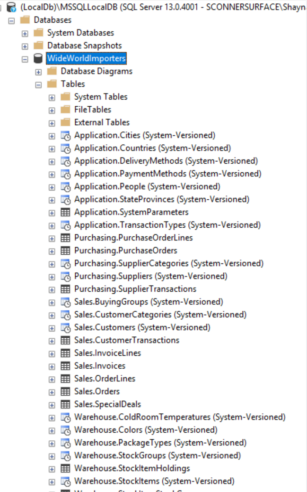
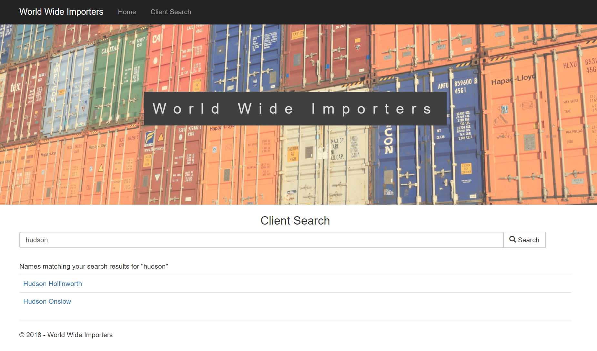
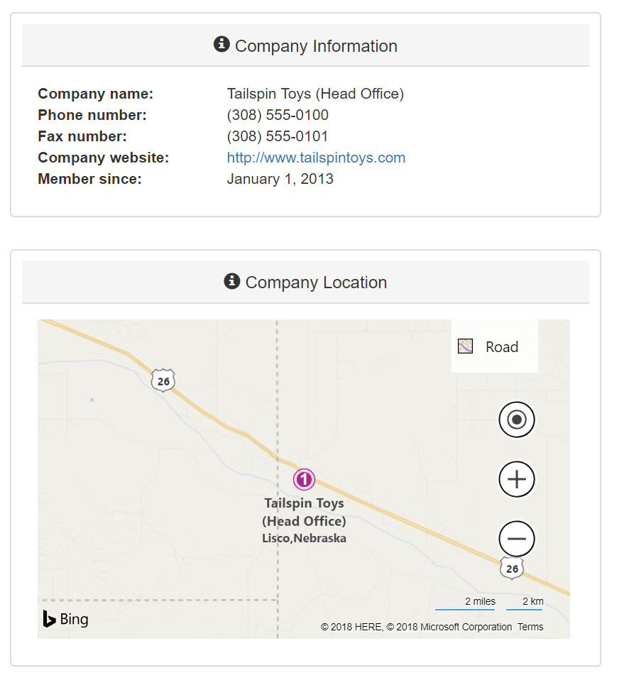

# Homework 6
For assignment 6, we used the "Code First with an Existing Database" workflow and Entity Framework to create models and configurations for our MVC project. We used LINQ queries to retrieve data from the existing database and used view models to pass that data to the views.  

* [Assignment page](http://www.wou.edu/~morses/classes/cs46x/assignments/HW6_1819.html)
* [Code repo for assignment](https://github.com/shaynuhcon/ConnerShayna_CS460/tree/master/HW6)
* [Back to main page](../README.md)

---

## Code First with Existing Database and Entity Framework
As usual, I created an empty MVC project. Then I downloaded and restored the database assigned for this project. I have used EF many times with an existing database have not used the tool/wizard that generates the code for you. It is handy for importing a large database to code however I've never used one large database at once so that is likely why I've never had to use this tool before. When building other projects or APIs I usually just bring in the tables/data that I am using and build my own models/configurations. In any case, this was still a great tool for bringing in a large amount of data where it would be too time consuming to build many models and configurations. 

I use SQL Server Management Studio a lot so didn't have any issues there. Here is a screenshot of the database/tables in SSMS:



## People Search Feature
For this assignment, I decided to just use one controller (```ClientController.cs```) since both features were basically the same with the second feature building on top of the first. I have used LINQ and LINQPad before and actually used it in the last assignment as well. For the controller, I used the following 3 methods:

```csharp
public ActionResult Search()
{
    // Return view where user can search for person by name
    return View();
}

[HttpPost]
public ActionResult Search(PeopleViewModel model)
{
    // Search for any person whose name contains input provided by user 
    // then assign to view model
    model.PeopleResults = _context.People
        .Where(p => p.FullName.Contains(model.Name))
        .Select(p => new PersonSearchViewModel
        {
            PersonID = p.PersonID,
            FullName = p.FullName
        }).ToList();

    _context.Dispose();

    // Return view with search results
    return View(model);
}

[HttpGet]
public ActionResult Get(int id)
{
    // Get Person values needed for profile
    PersonViewModel person = _context.People
        .Where(p => p.PersonID == id)
        .Select(p => new PersonViewModel
        {
            FullName = p.FullName,
            PreferredName = p.PreferredName,
            PhoneNumber = p.PhoneNumber,
            FaxNumber = p.FaxNumber,
            EmailAddress = p.EmailAddress,
            // SqlFunctions used to format how date will be displayed
            ValidFrom = SqlFunctions.DateName("month", p.ValidFrom) + " " +
                        SqlFunctions.DateName("day", p.ValidFrom) + ", " +
                        SqlFunctions.DateName("year", p.ValidFrom),
            Photo = p.Photo
        }).FirstOrDefault();

    _context.Dispose();

    // Return view with results for person
    return View(person);
}
```

The ViewModels I used for this feature are ```PeopleViewModel```, ```PersonSearchViewModel``` and ```PersonViewModel```. The ```PeopleViewModel``` and ```PersonSearchViewModel``` used specifically for the Search functionality and PersonViewModel is used to pass data for a single, specific person:

```csharp
public class PeopleViewModel
{
    // User search input
    public string Name { get; set; }

    // List to store search results
    public IEnumerable<PersonSearchViewModel> PeopleResults { get; set; }
}

public class PersonSearchViewModel
{
    // ID of person in database, not displayed to user
    public int PersonID { get; set; }

    // Full name to display to user in view
    public string FullName { get; set; }
}

// Data to be used on client profile page
public class PersonViewModel
{
    [DisplayName("Full name")]
    public string FullName { get; set; }

    [DisplayName("Preferred name")]
    public string PreferredName { get; set; }

    [DisplayName("Phone number")]
    public string PhoneNumber { get; set; }

    [DisplayName("Fax number")]
    public string FaxNumber { get; set; }

    [DisplayName("Email address")]
    public string EmailAddress { get; set; }

    [DisplayName("Member since")]
    public string ValidFrom { get; set; }

    public byte[] Photo { get; set; }
}
```

The Search method simply returns the Search view as shown below:


 Once a user provides a search string (name), the Search view passes that data through the ```PeopleViewModel``` then also uses that same model to pass the search results back to the Search view:
 
 

 From there, a user can click on any person's name. That request will be routed to the Get method which takes an ```id``` parameter. I chose to use the ```PersonID``` here instead of ```FullName``` because when possible, I prefer searching by int instead of string. The Person result is then passed to the Get view using a ```PersonViewModel``` and that data is displayed to the user:

 

Here is a video link demonstrating the People Search feature:

[](https://youtu.be/lpgjOclANSk)

## Customer Sales Dashboard Feature
For this feature, I used the same Search/Get methods as before however I built on top of them to accommodate the new functionality requested. First, I updated the ```Get``` method to also check if the person was a ```PrimaryContactPerson``` on the ```Customer``` table by adding the following lines:

```csharp
// Check if Person is a PrimaryContactPerson in Customer table
var primary = _context.Customers.FirstOrDefault(c => c.PrimaryContactPersonID == id);

// If Person is PrimaryContactPerson, redirect to get full Customer profile
if (primary != null)
{
    _context.Dispose();
    return RedirectToAction("GetPrimaryContact", new {id});
}
```

If the person was a primary contact person, the controller would redirect to a new action called ```GetPrimaryContact``` which takes an id as its parameter:

```csharp
// Method for full customer sales dashboard
public ActionResult GetPrimaryContact(int id)
{
    var customer = new CustomerViewModel();

    // Get Person data
    customer.Person = _context.People
        .Where(p => p.PersonID == id)
        .Select(p => new PersonViewModel
        {
            FullName = p.FullName,
            PreferredName = p.PreferredName,
            PhoneNumber = p.PhoneNumber,
            FaxNumber = p.FaxNumber,
            EmailAddress = p.EmailAddress,
            ValidFrom = SqlFunctions.DateName("month", p.ValidFrom) + " " +
                        SqlFunctions.DateName("day", p.ValidFrom) + ", " +
                        SqlFunctions.DateName("year", p.ValidFrom),
            Photo = p.Photo
        }).FirstOrDefault();

    // Get Company data
    customer.Company = _context.Customers
        .Where(c => c.PrimaryContactPersonID == id)
        .Select(c => new CompanyViewModel
        {
            CompanyName = c.CustomerName,
            AccountOpened = SqlFunctions.DateName("month", c.AccountOpenedDate) + " " +
                            SqlFunctions.DateName("day", c.AccountOpenedDate) + ", " +
                            SqlFunctions.DateName("year", c.AccountOpenedDate),
            FaxNumber = c.FaxNumber,
            PhoneNumber = c.PhoneNumber,
            Website = c.WebsiteURL,
            // The following 3 variables are used for real-time map on results page
            DeliveryLocation = c.DeliveryLocation,
            City = c.City.CityName,
            State =  c.City.StateProvince.StateProvinceName
        }).FirstOrDefault();

    // Get data on invoice purchase amounts
    customer.Purchases = new PurchaseViewModel
    {
        TotalOrders = _context.Customers.Where(c => c.PrimaryContactPersonID == id).SelectMany(c => c.Orders)
            .ToList().Count,
        TotalGrossSales = _context.Customers
            .Where(c => c.PrimaryContactPersonID == id)
            .SelectMany(c => c.Orders
                .SelectMany(o => o.Invoices
                    .SelectMany(i => i.InvoiceLines.Select(il => il.ExtendedPrice)))).ToList().Sum(),
        TotalProfit = _context.Customers
            .Where(c => c.PrimaryContactPersonID == id)
            .SelectMany(c => c.Orders
                .SelectMany(o => o.Invoices
                    .SelectMany(i => i.InvoiceLines.Select(il => il.LineProfit)))).ToList().Sum()
    };

    // Get most profitable items from this customer
    int customerId = _context.Customers.FirstOrDefault(c => c.PrimaryContactPersonID == id).CustomerID;

    customer.Items = _context.Invoices.Join(_context.InvoiceLines, i => i.InvoiceID, il => il.InvoiceID,
            (i, il) => new {Invoice = i, InvoiceLine = il})
        .Where(x => x.Invoice.CustomerID == customerId)
        .OrderByDescending(il => il.InvoiceLine.LineProfit)
        .Take(10)
        .Select(item => new ItemViewModel
        {
            StockItemID = item.InvoiceLine.StockItemID,
            Description = item.InvoiceLine.Description,
            LineProfit = item.InvoiceLine.LineProfit,
            SalesPerson = item.Invoice.Person4.FullName
        }).ToList();

    _context.Dispose();

    return View("CustomerDashboard", customer);
}
```

For this, I used one ```CustomerViewModel``` compromised of other view models to pass to the view:

```csharp
// Main ViewModel for Customer Dashboard feature
public class CustomerViewModel
{
    // Same ViewModel used for first feature which will also be used here
    public PersonViewModel Person { get; set; }

    // ViewModel to hold company information 
    public CompanyViewModel Company { get; set; }

    // ViewModel to hold information regarding purchase history
    public PurchaseViewModel Purchases { get; set; }

    // List of items that that are most profitable
    public IEnumerable<ItemViewModel> Items { get; set; }
}
```

This just seemed a lot cleaner to me as opposed to having just one view model with a ton of properties. This way, I can see it easily broken down into different categories while still only needing to maintain the values I retrieve from the database without the extra fluff. I also used a different view called ```CustomerDashboard.cshtml```. Normally I would've just created this section in a partial view and used the same ```Get.cshtml``` view from the first feature but decided to just keep these separated for this assignment. 

Here is a video link demonstrating the Customer Saleas Dashboard feature:

[](https://youtu.be/lpgjOclANSk)

## Map Feature
I did include a map on the Customer Sales Dashboard results. The location details are stored in the ```CompanyViewModel``` and those properties are retrieved in the LINQ query shown above in the ```GetPrimaryContact``` method:

```csharp
public class CompanyViewModel
{
    [DisplayName("Company name")]
    public string CompanyName { get; set; }

    [DisplayName("Phone number")]
    public string PhoneNumber { get; set; }

    [DisplayName("Fax number")]
    public string FaxNumber { get; set; }

    [DisplayName("Company website")]
    public string Website { get; set; }

    [DisplayName("Member since")]
    public string AccountOpened { get; set; }

    // Used to pinpoint location on map
    public DbGeography DeliveryLocation { get; set; }

    // Used to label location map
    public string City { get; set; }

    // Used to label location map
    public string State { get; set; }
}
```

 
