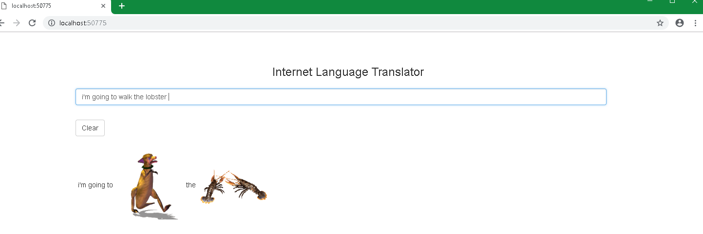
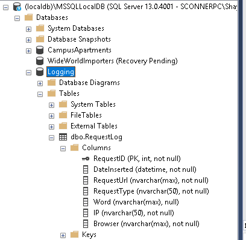
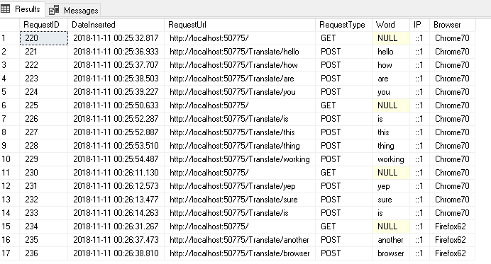
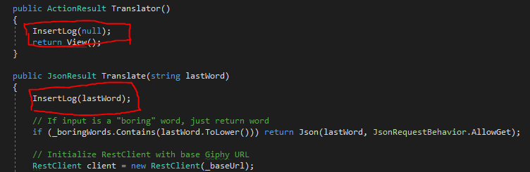
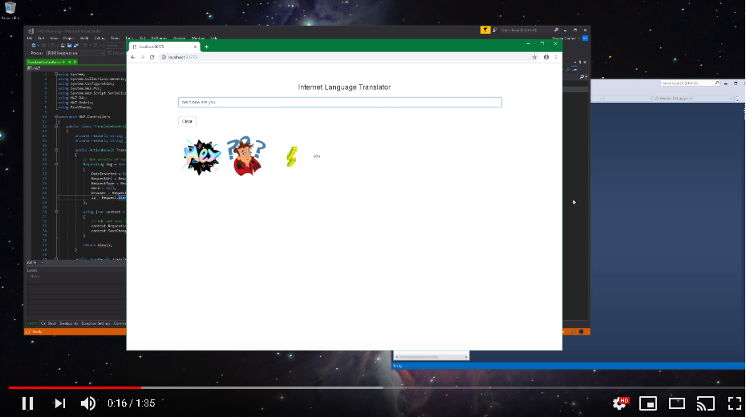

# Homework 7
For assignment 7, we used AJAX to build a single page, dynamic MVC application. 

* [Assignment page](http://www.wou.edu/~morses/classes/cs46x/assignments/HW7_1819.html)
* [Code repo for assignment](https://github.com/shaynuhcon/ConnerShayna_CS460/tree/master/HW7)
* [YouTube video of Internet Language Translator](https://youtu.be/KFKtfWC4L2U)
* [Back to main page](../README.md)

---

## Giphy API
Before I messed around with the view and custom routing, I became familiar with the Giphy Sticker API. We build and call a lot of APIs both for internal and external use at work so this part was pretty simple. From the assignment page, I knew we were using the ```v1/stickers/translate``` endpoint so I just needed to figure out the parameters required which I found on the Giphy doc page:


I went with the RestSharp nuget package for this because it's what I'm familiar with. Normally, I'd put the API calls in a separate data layer and use a service to access and transform the data but for the sake of simplicity, I placed the login in my ```TranslateController``` method. I put both the base Giphy URL and the API key in the secrets file: 

```xml
<appSettings>
  <add key="GiphyUrl" value="https://api.giphy.com/v1/stickers/translate"/>
  <add key="GiphyKey" value="DFkqHdvwYnBi5k8Mfweun313FMiyoqFS"/>
</appSettings>
```

Then I set those as global variables in the controller:

```csharp
private readonly string _baseUrl = ConfigurationManager.AppSettings["GiphyUrl"];
private readonly string _apiKey = ConfigurationManager.AppSettings["GiphyKey"];
```

I could have just put the base URL in the appSettings section directly in Web.config instead of the secrets file since I didn't really need to obfuscate that part. Decided to just put it in the secrets file to keep those two variables together. Below is the actual call to the Giphy API that resides in the ```Translate``` method in the ```TranslateController``` class: 

```csharp
// Initialize RestClient with base Giphy URL
RestClient client = new RestClient(_baseUrl);

// Initialize RestRequest with parameters
RestRequest request = new RestRequest(Method.GET);
request.AddParameter("api_key", _apiKey);
request.AddParameter("s", lastWord);

// Get response from Stickers API 
IRestResponse response = client.Execute(request);

// Deserialize and return json response
var data = new JavaScriptSerializer().Deserialize<object>(response.Content);
return Json(data, JsonRequestBehavior.AllowGet);
```

This is where I used the parameters as listed on Giphy's docs: the Giphy API key parameter (```api_key```) and the search term parameter (```s```). The ```IRestResponse``` object contains the string data in the Content property as well as response headers and other properties I didn't need. I converted that to a json object and sent that data to the view.

## Single Page View
The ```Translator.cshtml``` view I made is really simple:

```html
@{
    ViewBag.Title = "CS 460 Homework 7";
}

@section Scripts 
{
    <script type="text/javascript" src="~/Scripts/Translate.js"></script>
}

<h3>Internet Language Translator</h3>

<form>
    <div class="row center">
        <div class="form-group col-md-12">
            <input type="text" class="form-control" id="userInput" name="userInput" pattern="[^a-zA-Z0-9]">
            <div class="wrapped">
            <button class="btn btn-default" id="clear">Clear</button>
            </div>
        </div>
    </div>
</form>

<div class="col-md-12">
    <div id="output"></div>
</div>
```

The ```output``` div is where either a string or an image element will be appended to when the space button is pressed. 

## Custom Routing and AJAX
Never used custom routing before but it was a pretty straight-forward concept to grasp and seems really useful. I have one custom route and tested it by changing the parameters to see if an error is thrown:

```csharp
// Custom route for Translate/Translator/{lastWord} method 
routes.MapRoute(
    name: "Translate",
    url: "Translate/{lastWord}",
    defaults: new { controller = "Translate", action = "Translate" }
);
```

Majority of the time for this project was spent writing up the scripts in my ```translate.js``` file: 

```javascript
// Wait for spacebar to be pressed on textbox 
var userInput = document.getElementById("userInput");
userInput.addEventListener("keypress",
    function(e) {
        if (e.key === " " || e.key === "Spacebar") {
            getData();
        }
    });

// Clear textbox 
var clear = document.getElementById("clear");
clear.addEventListener("click",
    function() {
        location.reload();
    });

// Get most recent word entered in textbox and send to controller
function getData() {
    var userInput = $("#userInput").val();
    var words = userInput.split(" ");
    var lastWord = words[words.length - 1];

    $.ajax({
        type: "POST",
        dataType: "json",
        url: "../Translate/" + lastWord,
        success: displayData,
        error: errorOnAjax
    });
}

// If "boring" word, add to output as string otherwise show gif 
function displayData(data) {
    var div = document.getElementById("output");

    if (typeof data == "string") {
        div.innerHTML += data + " ";
    } else {
        show_image(data.data.embed_url);
    }
}

// Append gif to output 
function show_image(src) {
    var div = document.getElementById("output");
    var sticker = '<iframe src="' +
        src +
        '" width="150" height="150" frameBorder="0" class="giphy-embed" allowFullScreen></iframe>';
    div.innerHTML += sticker;
}

// Error
function errorOnAjax() {
    console.log("error");
}

```

I've used Javascript, jQuery and AJAX before but it has been a long time since I've had to use it to this extent. Basically, the event listener checks each key press and once the spacebar is pressed, the ```getData()``` function grabs all the words in the ```userInput``` textbox and splits them to get the most recent word entered (```lastWord```). Using AJAX, that word gets posted to the ```Translate``` method. 

To filter between "boring" and "interesting" words, I just made a list of "boring" words to check against incoming user input strings. Here is the list of words: 

```csharp
private readonly List<string> _boringWords = new List<string>
{
    "the",
    "a",
    "of",
    "i",
    "is",
    "am",
    "me",
    "they",
    "you",
    "he",
    "she",
    "it",
    "i'm",
    "to",
    "my",
    "this",
    "that",
    "him",
    "her",
    "going",
    "for",
    "you're",
    "your"
};
```

Before I call the Giphy API using that word, I check it against the above list here:

```csharp
// If input is a "boring" word, just return word
if (_boringWords.Contains(lastWord.ToLower())) return Json(lastWord, JsonRequestBehavior.AllowGet);
```

If it's in the "boring" words list, the single word is posted back as a string data type. The ```displayData(data)``` checks if the data received is a string data type and if it is, it appends the word only to the ```output``` div. If it's an object data type, the ```embed_url``` value from the Giphy response is sent to the ```showImage(src)``` function with the ```src``` variable being the URL. This method appends the gif received from Giphy to the ```output``` div as shown below:


 
## Logging 
For the logging portion of this assignment, I named the database Logging and the table RequestLog. Logged the date and time the request was made as well as the URL, IP address, and browser of the request. I also added a Word column which logs the ```lastWord``` variable. The Word value is nullable because clearing the textbox or refreshing the page doesn't require any input:



Here are the events that were logged during the YouTube video demo: 



The table shows each time a request was made and also helps to show when the user refreshed the page or cleared their results. I pulled the database into code using EF once again. The context class is called ```LoggingContext``` which I named after the database itself and here is the ```RequestLog``` model:

```csharp
public class RequestLog
{
    public int RequestId { get; set; }

    public DateTime DateInserted { get; set; }

    public string RequestUrl { get; set; }

    public string RequestType { get; set; }

    public string Word { get; set; }

    public string Ip { get; set; }

    public string Browser { get; set; }
}
```

In the ```TranslateController```, I created an ```InsertLog``` method:

```csharp
private void InsertLog(string word)
{
    // Get details of request
    RequestLog log = new RequestLog
    {
        DateInserted = DateTime.Now,
        RequestUrl = Request.Url?.ToString(),
        RequestType = Request.RequestType,
        Word = word,
        Browser = Request.Browser.Type,
        Ip = Request.UserHostAddress
    };

    using (var context = new LoggingContext())
    {
        // Add and save log to table
        context.RequestLogs.Add(log);
        context.SaveChanges();
    }
}
```

This method is called from both the ```Translator()``` method and the ```Translate(string lastWord)``` method and writes the event details to the RequestLog table. 



## Link to YouTube Demonstration

[](https://youtu.be/KFKtfWC4L2U)
