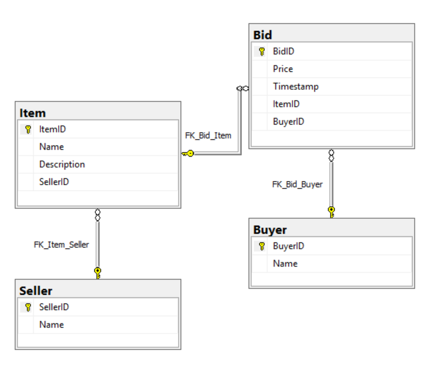
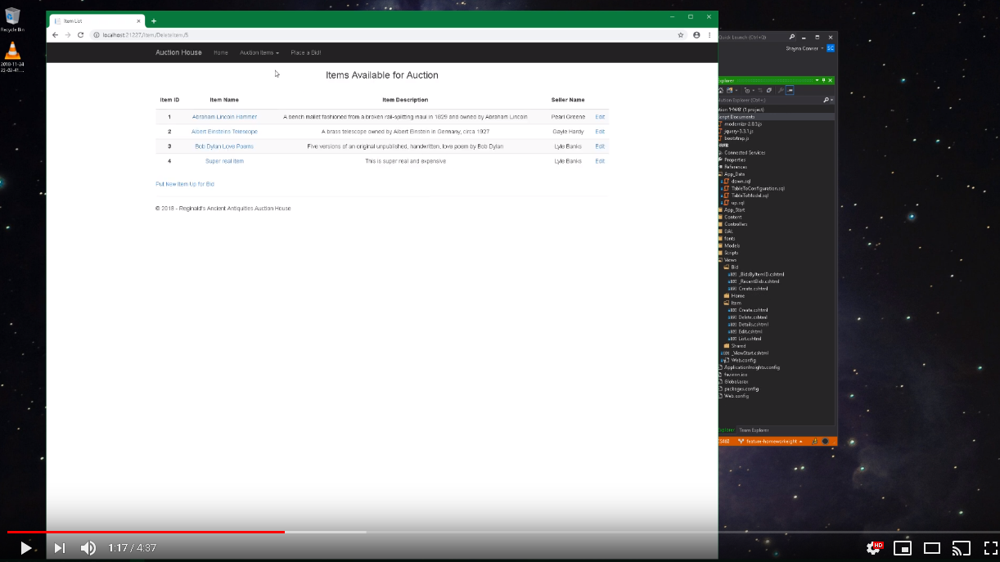

# Homework 8
For assignment 8, we created our own multi-table, relational database to build an MVC web application that resembled a live-bidding auction website.

* [Assignment page](http://www.wou.edu/~morses/classes/cs46x/assignments/HW8_1819.html)
* [Code repo for assignment](https://github.com/shaynuhcon/ConnerShayna_CS460/tree/master/HW8)
* [YouTube video of Auction House website](https://youtu.be/qhaDcfE8eEY)
* [Back to main page](../README.md)

---

## ERD
Built database and tables using given properties in assignment page but also added IDs to use for primary/foreign keys.

## Link to YouTube Demonstration
Video shows following site functions:
1. Home page showing recent bids ordered by timestamp
2. View list of all items 
3. Create page - add two items 
4. Edit page - edit one of the added items
5. Delete page - delete one of the added items 
6. Item details page - item info and bids (if any)
7. Bid on item and have page refreshed to show new bid
8. Bid on item in separate window to show live-bid functionality on details page 

