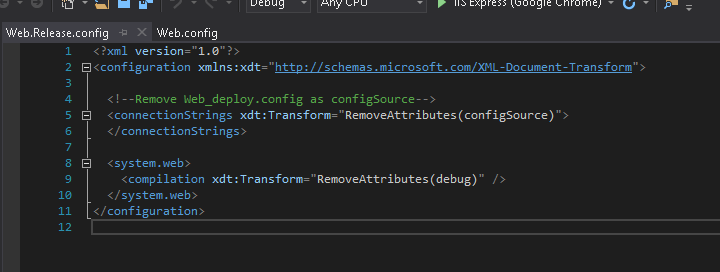

# Homework 9
For assignment 9, we deployed our website and database from homework 8 to Azure. 

* [Assignment page](http://www.wou.edu/~morses/classes/cs46x/assignments/HW9_1819.html)
* [Code repo for assignment](https://github.com/shaynuhcon/ConnerShayna_CS460/tree/master/HW8)
* [Deployed Auction House Website](http://connerhw8.azurewebsites.net/)
* [Back to main page](../README.md)

---

## Deploy Azure SQL Database
I use Azure daily at my job for web apps, functions, databases, Service Bus queues/topics, Active Directory, and other things so this was all pretty standard for me. The following screenshots show the steps I took to create the database/server on Azure as well as seeding the data using my up.sql script in SSMS:


Once this was up and running, I changed the connection string in my Web.config file to use a Web_deploy.config file as was instructed in the lecture notes. The lecture notes also stated to change that back to ```<connectionStrings></connectionStrings>``` when merging back into master since the app service would not be able to find the Web_deploy.config file. As a workaround, I added a transform to the Web.Release.config file instead to remove the ```configSource``` attribute. This just seemed cleaner to me as opposed to having different values when deploying or debugging locally. The below screenshots shows the changes made for the Web_deploy.config file as well as the transform for release:




## Deploy HW8 To App Service
To deploy homework 8 to an Azure App Service, I first created the web app in the Azure Portal then used the Publish wizard in Visual Studio to deploy to the newly created app service:


As shown in the screenshots above, I used a ```Release``` configuration for the deployment. That way the app service will not look for the Web_deploy.config file once deployed. Once deployed, I set the connection string in Application Settings blade in the Azure Portal for my app service:


## Screenshot of Deployed Web App


